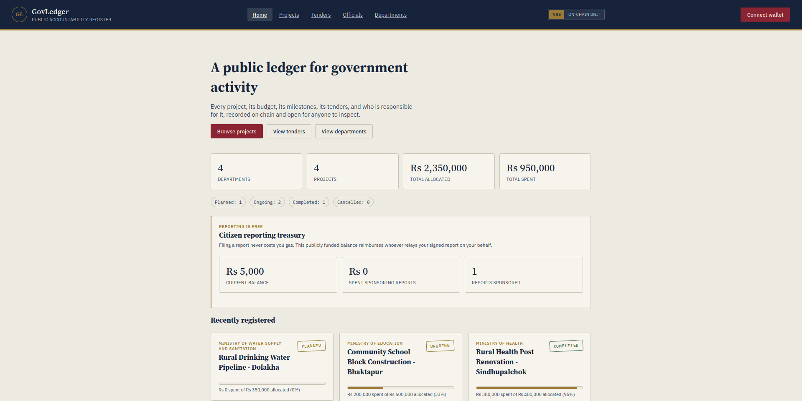
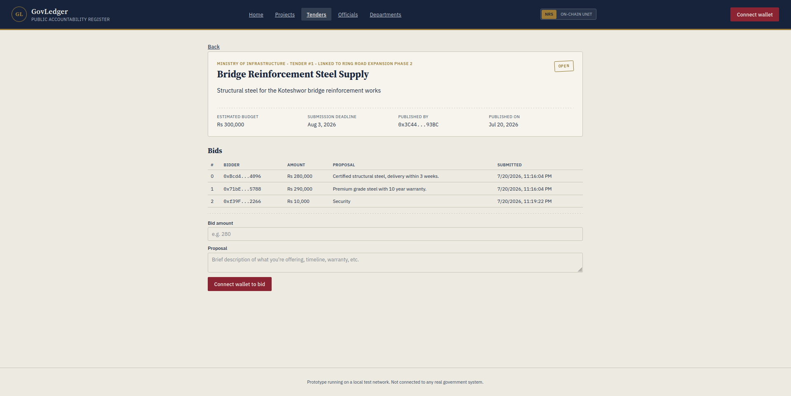
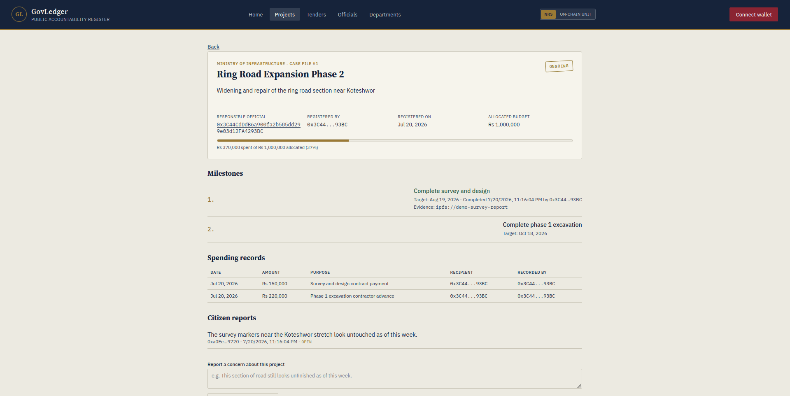

# Wazens

Wazens is a blockchain-based system designed to improve transparency and accountability in government operations. 
It records projects, budgets, milestones, and financial activity on a public ledger. Every action is cryptographically linked to a wallet address, creating a verifiable and tamper-resistant record of responsibility and transparency is maintained.

This is a prototype: it runs on a local test blockchain (anvil) with test accounts and test funds, not a real network. 


## Core Features

* **Department and Role Management**:
  Create government departments, assign department heads, and manage which officials are allowed to take action within each department

* **Project Tracking**:
  Register projects with a defined budget, assign a responsible official, and keep track of how funds are being used over time

* **Milestone Management**:
  Break projects into smaller milestones and mark progress as work gets completed, with the option to attach supporting evidence

* **Spending Records**:
  Record each expense with details such as the amount, purpose, recipient, and the official who logged it

* **Public Tender System**:
  Publish tenders, allow anyone to submit bids, and make the selection process transparent by showing all bids and final decisions

* **Gasless Citizen Reporting**:
  Allow citizens to report issues or concerns without needing to pay transaction fees, using a simple signature-based process

* **On-Chain Transparency**:
  Store all records on the blockchain so they can be viewed and verified by anyone at any time
 
## Tech Stack

- Smart Contracts: Solidity (Foundry)
- Blockchain: Anvil (local Ethereum)
- Frontend: Vite + Ethers.js
- Scripting: Bash + Node.js

## Architecture of the Project

```
wazens/
  contracts/     Solidity contracts, tests, and deploy scripts (Foundry)
  frontend/      React + Vite + ethers.js single page app
  relayer/       Small local Node process that sponsors citizen reports
  scripts/       Orchestration scripts that wire it all together
```


## Prerequisites

The following tools need to be installed:
- Node.js
- Foundry (forge, cast, anvil)

To install foundry:
```bash
curl -L https://foundry.paradigm.xyz | bash
foundryup
```


## Run the project

To run the project locally, run the following commands:

```bash
cd wazens
./scripts/setup.sh      # one time: installs contract + frontend + relayer deps
./scripts/run-local.sh  # starts anvil, deploys + seeds, starts the relayer, starts the frontend
```

To run the project on sepolia testnet, run the following commands:

```bash
cd wazens
./scripts/setup.sh      # one time: installs contract + frontend + relayer deps
./scripts/deploy.sh sepolia # starts anvil, deploys + seeds, starts the relayer, starts the frontend
# Considering you have set required values in .env
```

To run it in separate terminals (useful when you want to keep anvil's or the relayer's logs visible, or restart just the frontend):

```bash
# terminal 1
./scripts/start-chain.sh

# terminal 2, once anvil is running
./scripts/deploy.sh
./scripts/start-relayer.sh

# terminal 3
./scripts/dev.sh
```

## Preview

### Homepage



### Tender application page



### Project Information Page




